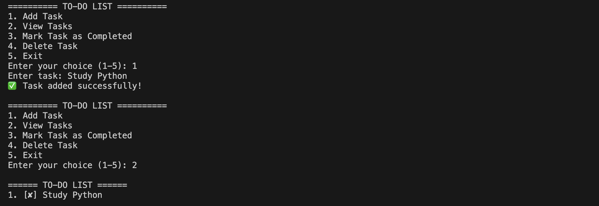

# 📝 To-Do List App

A simple command-line To-Do List application built using Python. It allows users to efficiently manage their daily tasks with persistent JSON storage.

---

## 🚀 Features

- ➕ Add new tasks
- 📋 View all tasks
- ✅ Mark tasks as completed
- 🗑️ Delete tasks
- 💾 Save tasks permanently using JSON
- 🔄 Automatically load tasks on startup
- ⚠️ Input validation and exception handling

---

## 🛠️ Technologies Used

- Python 3
- JSON
- VS Code

---

## 📂 Project Structure

```text
todo_app/
│
├── main.py
├── tasks.json
├── README.md
└── screenshots/
    ├── image(41).png
    ├── image copy.png
    ├── image copy 2.png
    └── image copy 3.png
```

---

## ▶️ How to Run

```bash
python3 main.py
```

---

## 📋 Menu

```text
========== TO-DO LIST ==========

1. Add Task
2. View Tasks
3. Mark Task as Completed
4. Delete Task
5. Exit
```

---

# 📸 Screenshots

## ➕ Add Task



---

## ✅ Mark Task as Completed


---

## 🗑️ Delete Task


---

## 👋 Exit Application


---

## 👨‍💻 Author

**Dev Swami**

GitHub: https://github.com/Devkr0115